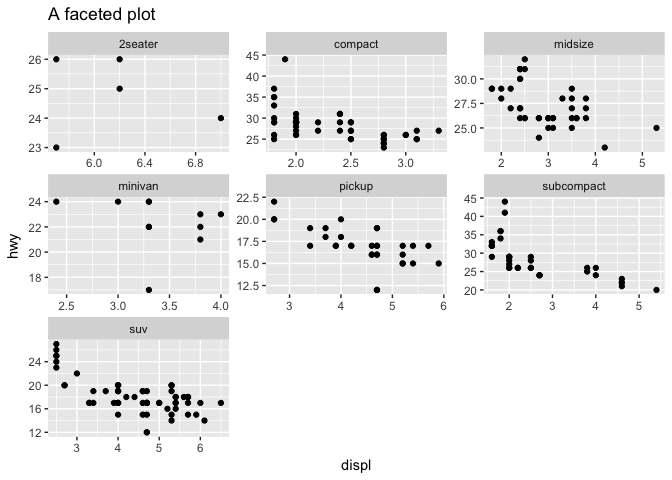
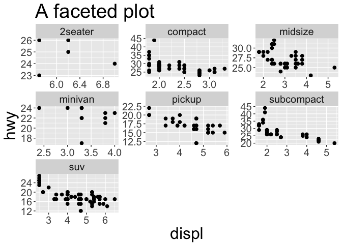

<!-- README.md is generated from README.Rmd. Please edit that file -->
EMK
===

EMK is a collection of miscellaneous functions I have written that I personally find helpful in a variety of contexts.

Installation
------------

You can install EMK from github with:

``` r
# install.packages("devtools")
devtools::install_github("EllaKaye/EMK")
```

``` r
library(EMK)
```

`n_letter_words`
----------------

`n_letter_words` is a function that will produce all 'words' of `n` letters long. Its usage is `n_letter_words(n, num_letters = 26, case = c("upper", "lower"), as_vector = FALSE)`.

``` r
n_letter_words(3)
#> # A tibble: 17,576 x 1
#>     word
#>  * <chr>
#>  1   AAA
#>  2   BAA
#>  3   CAA
#>  4   DAA
#>  5   EAA
#>  6   FAA
#>  7   GAA
#>  8   HAA
#>  9   IAA
#> 10   JAA
#> # ... with 17,566 more rows
three_vec <- n_letter_words(3, as_vector = TRUE)
c(head(three_vec), tail(three_vec))
#>  [1] "AAA" "BAA" "CAA" "DAA" "EAA" "FAA" "UZZ" "VZZ" "WZZ" "XZZ" "YZZ"
#> [12] "ZZZ"
n_letter_words(5, num_letters = 2, case = "lower")
#> # A tibble: 32 x 1
#>     word
#>  * <chr>
#>  1 aaaaa
#>  2 baaaa
#>  3 abaaa
#>  4 bbaaa
#>  5 aabaa
#>  6 babaa
#>  7 abbaa
#>  8 bbbaa
#>  9 aaaba
#> 10 baaba
#> # ... with 22 more rows
```

`ggpres`
--------

Typically, if you have a plot designed to look good in print or on the web, when it is included in a presentation, the text on the title, axes, legend and facet strips is too small to be read by everyone in the room. `ggpres` fixes that by taking a `ggplot` plot and increasing the size of the text. Usage is `ggpres(g, title_size = 24, text_size = 18)`. `ggpres` only deals with text size, and further adjustments to the plot may still be necessary to make it appropriate for a presentation, such as increasing point size or line width. Thanksfully, the modular nature of `ggplot` makes it easy to make such adjustments after passing the plot through `ggpres`.

``` r
library(ggplot2)
g <- ggplot(mpg, aes(displ, hwy)) +
  geom_point() +
  facet_wrap(~class, scales = "free") + 
   ggtitle("A faceted plot")
g
```



``` r
ggpres(g, text_size = 15) +
  geom_point(size = 2)
```


